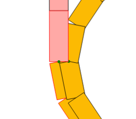

**Progress**

---

_20/09/2022_ **Work on piece characteristics determination helper**  
Add GUI buttons to help move rectangles up and down.  
Questions raised on best way to represent pieces. "Manual representation" with multiple rectangles, width, height, position of each, and separately position of connectors?  
Or succession of Bezier curves for the shape of piece, with points at the end of each bezier curve being a connector?
Latter seems much better. Would allow for precise connection of piece. However difficult to determine pieces with more than 2 connectors (or single connector pieces). A superposition of multiple bezier curves could do the trick.  
How to calculate collisions with just Bezier curve? This is an issue.  
Made Bezier curve plotter, need to add width to curves.
This is done by adding OBBs around curves

_21/09/2022_ **Work on piece characteristics determination helper**  
Add inputs for users to interact with the Bezier plotter.  

_22/09/2022_ **Work on Bezier curve piece helper: connectors**  
Add ability to determine the connectors of a piece.

_23/09/2022_ **Work on Bezier curve piece helper: connectors**  
Add option to draw multiple bezier curves for a single piece. This is to allow for pieces with more than 2 connectors and multi-level pieces.
Add a level to connectors and to rectangles (between 0 and 1, perhaps 2).
  
Now need a separate input row that automatically fills in the bezier inputs for an arc with: (startPos, radius, startAngle, endAngle)

_25/09/2022_ **Work on Bezier curve piece helper: plotting arc circles**  
Add function to plot a bezier curve representation of an arc circle. Add inputs to specify the arc circle to plot on screen. Distance between bezier points 1-2 and 3-4 is given by a formula found on https://stackoverflow.com/questions/1734745/how-to-create-circle-with-b%C3%A9zier-curves.

_29/09/2022_ **Finish Bezier curve piece helper. Start on frontend with Solid.**   
Determine 13 simple tracks with bezier curve piece helper.  
Chose Solid as JS framework for frontend of the application. Other frameworks were considered (svelte, react...). Chose because of performance and package size. Don't need a massive framework with lots of support for specific things for this like react - small app. 
See https://krausest.github.io/js-framework-benchmark/current.html
Get images of pieces as assets.

_06/10/2022_ **Fronted**  
Delete backgrounds on track images. Improve track list design. Add page routing.

_26/10/2022_ **Cpp backend**  
Make class for vec2d, Obb, Piece. Add function to rotate single vec2d, and then single Obb.

_20/11/2022_ **Cpp backend and frontend**  
Make a canvas to display tracks generated in frontend.
Add function to translate Pieces by a certain amount.
Start implementation of the track generating function.
Check OBB collision detection using SAT (https://gamedev.stackexchange.com/questions/25397/obb-vs-obb-collision-detection).

COULD IMPROVE: OBB Normals are re-calculated at each SAT. Could instead store them.

_20/11/2022_ **Cpp backend**  
Finish collision function.
Collision between two pieces is rather expensive? Discussion on the importance to keep OBBS low.
O(n*m) for collision between two pieces.

/!\ assumption made in track generation algorithm: Two consecutive pieces can never collide with each other.
/!\ 2nd assumption: parts of different levels do not collide!

What to do if the placeable piece has no connectors available left?

Only take into account euclidian distance for validation conditions for now.

_22/11/2022_ **Cpp backend**  
First successfully generated layouts!!
4 E, 2 A, 2 D, 2 A1, 1 A2, 5 E1, generates a track with 2 separate connected pieces??!
Add a bunch of "guides":
- Try to place a piece both left and right! (pretty much done)
- Only attempt piece flipping ones that have not been placed yet. (OK I think?)
- Remove connection between connectors for a simple boolean.
- Fast flipping: no flip for straight tracks, only exchange of the connector types for symmetric ones...
- Place a piece left with more importance depending on the total amount placed already...
- Split the number of turns in multiple smaller batches
- randomize the initial set of pieces before running 
- only show placed pieces
- Take away the bezier points? (unused for the generation of tracks)
- multi threading at the start? Or for testing of tracks?

- Problem with tracks containing the same connectors.
- Somehow determine in advance that a certain track will not work (or is unlikely to)?

- Mix up the order of each generation
- Add condition for the farthest away a piece can be placed.

- Modify the validation conditions for larger tracks (make them a percentage of the number of pieces perhaps?)

- Made modulus a constant value of a vector to avoid lots of calculation!

Removed testing of the same track multiple times. This saves a LOT of time. (comparison with / without ?) Talk about the FACTORIAL nature of the problem otherwise.

Similar inputs can take SIGNIFICANTLY different run times.
This means that a lot of improvement can be done.
(look at track 1, 2, 3) => 1 and 2 were made with initial shuffling, 3 without.

HUGE problems:
 - When a rather early track is place just in from of the validation track thus blocking it.
 - When the initial track goes "too far too soon" thus making the validation piece out of reach for all the incoming tests.

How to solve these?
 - Make it more difficult for the first half of pieces placed to come close the initial piece.
 - Make it impossible (or perhaps better, more difficult) for initial tracks to be placed out of reach.

_24/11/2022_ **Cpp backend**  
Added validation angle condition.
Add flip of pieces.

Found a case of impossible track (see impossible track).

Silly idea? Because the generation time is so dependant on initial conditions and has times varying from very very small to huge...
Could try for a certain amount of time, and if not successful re-try with a different initial set of pieces...
With multiple threads trying it could be fine..?

_12/12/2022_ **Helper**  
Added a heuristic in the core to not allow pieces to be placed further away than half the total distance.
COULD IMPROVE THAT HEURISTIC TO RATHER NOT GO FURTHER THAN THE TOTAL DISTANCE LEFT IN HAND? (Need a nice way to know how much distance is left in hand)

Added option to load figure in the bezier helper to add a circle.
Added a circle to each figure, encompassing all the OBBS in that figure to make a much more efficient collision detection system.

_8/01/2023_ **BACKEND CORE**  
Add a test for rails in between the validation connectors before validating the track.
Can talk about how to test if there are pieces in between the two validation connectors:
this is done by virtually drawing a line between the two connectors and testing if there is any placed piece that has an OBB that intersects that line.

There is a very serious performance issue with the algorithm to test for pieces in between two connectors. Has been disabled at the minute.
Need to verify the complexity of it. (or time it?)

Need to disable the complete randomness.

Also need to modify the "between connectors" algorithm to not take into account the first and last pieces.

_10/01/2023_ **WASM FRONTEND**  

Put core to interact with frontend via WASM.
Use the emscripten compiler. Works with meson build system. Add the pieces.json as a file dependency of the compiled code.

IMPORTANT IMPROVEMENT: Made it so that a piece is first randomly flipped to the right or to the left before attempting to place it the first time. This prevents a "spiral" like generation.

Visual improvement: Modify colour of the piece depending on the piece type.

_11/01/2023_ **FRONTEND**  
Add loader and maximum generating time.
Fix memory issues.

_12/01/2023_ **CORE**  
Keep solid on a separate legacy branch.
Add levelling to placement of pieces. For efficiency, only check that the pieces that CHANGE the level are below zero.
Subtlety: After the first generation is unsuccessful, need to check that the first piece placed is at level zero.

_13/01/2023_ **CORE AND FRONTEND**  
Sanitise the set of track pieces before generation starts:
take away the odd ascending piece (Later need to take away the odd 3-connector piece... Or if 5 or more connector pieces come, need to see).

Painter algorithm to avoid weird clippings of pieces: draw first the ground level pieces, then the going-up pieces, then the 1rst level pieces, etc.

(Level 0 is outlined in black, level 1 in red)

Add calculation of a max level the track can go to at the start. Only allow ascending pieces to be placed within the right boundaries.

_16/01/2023_ **CORE**  
First two loop track built. Divide and conquer method: build one loop and then the second on top of the first.

_17/01/2023_ **CORE**  
The number of pieces placed is KEPT IN MIND rather than having a function to recalculate it each time it's needed. This is to shave off the complexity of calculating it which is O(n) rather than having it O(1) by keeping an int for it.  
Add a Loop class. Tracks have a number of Loops that they generate, depending on the number of 3-connector piece pairs that are in the initial set of pieces specified by the user.  
A loop is first created, and then the second loop is generated on top of the first loop.  
The partition of pieces at the very start before generating any loop is a big improvement from the previous version (the one with which we managed to build the first multi loop track):
Previous version was generating the first loop with any number of pieces, and then attempting to generate the second one on top of the first. This is bad because the first loop can use 80% of the pieces, and second loop is then unlikely to be buildable on top of the first. A good partition of the pieces before the generation should address this issue nicely.  
Also, previous version was kicking off many generation attempts for the first loop, and then only allowing one generation attempt for the second loop. This is bad, as this generation attempt is highly unlikely to be successful (worse conditions than normal 1-loop tracks, which themselves sometimes require tens of generation attempts before building).
Instead, in this version, the first loop is generated from a number of generation attempts. Then the second loop is given a number of generation attempts too, to build itself on top of the first loop.  

Very nice thought: No need for mulitple vectors of pieces. The same vector of pieces initially made can be used throughout the generation. A LoopGenerator is given the set of pieces as well as the range of indices it's allowed to work on!

_20/01/2023_ **CORE**  
Make SURE that for non-last loops, there are always 2 3con pieces in the set of placeable pieces, and that these pieces ARE ALWAYS placed before starting generating the next loop.

_21/01/2023_ **CORE**
Managed to get generations for multi-loops using the technique described above. The multiple loops are generated within the SAME VECTOR to avoid separation and re-gluing of vectors of pieces. 
Problems: 1) Often the first loop is generated with impossible conditions for the second loop to terminate (occulted connectors for example). Need to take this into consideration. For example, reset the previous loop if the generation was not possible for loop n.  
2) For more than 1 loop, the first loop often uses 3con pieces of the same type, making the second loop impossible to complete.